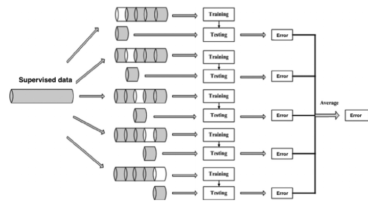
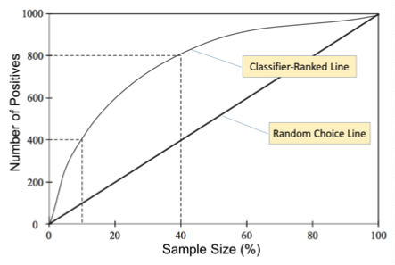
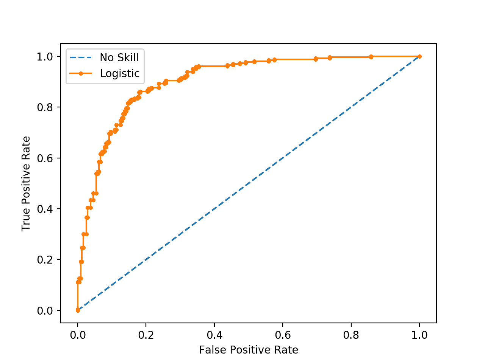
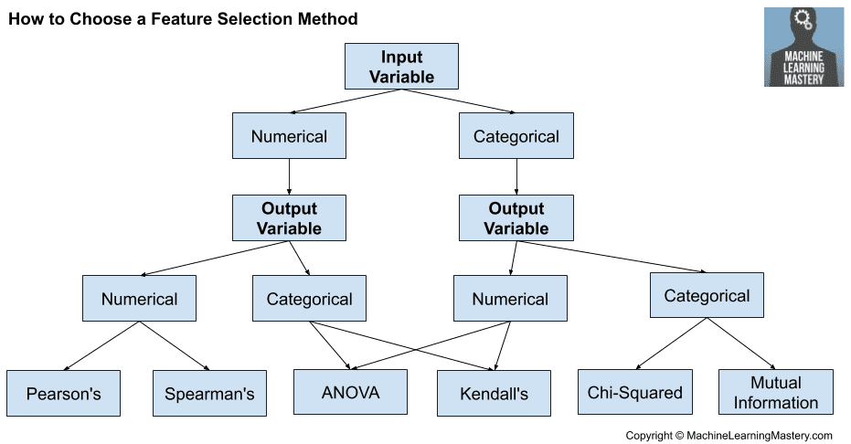

# Artificial Intelligence

## Machine Learning

### Overfitting

**Overfitting** happens when the leraning is affected by noise: the performance on the test set is way worse than that on the training set. A hypothesis $h$ overfits the dataset if there exists another hypothesis $h'$ such that:

$$
\begin{aligned} \text { error }_{\text {train }}(h) &<\text { error }_{\text {train }}\left(h^{\prime}\right) \\ \operatorname{error}_{\mathcal{E}}(h) &>\operatorname{error}_{\mathcal{E}}\left(h^{\prime}\right) \end{aligned}
$$

Overfitting can happen because of **noise** or **lack of representative instances**.

## Datasets

We can distinguish **4 types of data** in normal datasets:

- Categorical
  - Nominal: non-orderable $\rightarrow$ allows any one-to-one correspondence
  - Ordinal: orderable $\rightarrow$ allows any order preserving transformation
- Numerical
  - Interval: having meaningful differences but just + and $\rightarrow$ allows linear function transformations
  - Ratio: having a definition of 0 and allowing mathematical operations $\rightarrow$ allows any mathematical function, like standardization

We can cite 4 main problems in datasets: **noise/outliers**, **missing values**, **duplicates**, **inconsistencies**.

### Partitioning

To compute errors significantly, we should split the dataset into **traning set** (used to generate the model) and **test set**, used to compute the _test set error_. We can add a **validation set**, that will allow us to evaluate the model (for example after pruning or hyperparameter tuning) for tuning, which will then be followed by the test set.

We define the training/test and training/validation/test splits as **Holdout**. An alternative is represented by **Cross Validation** (k-fold), which randomly partitions the training set in $k$ subsets, and performs $k$ iterations uysing one of the subsets for test and the others for training. The results of tests are merged, and the final model is generated using the entire training set.



## Python libraries

### Numpy

WIP

### Pandas

WIP

### TensorFlow

WIP

## Classification

We usually intend classification to be **supervised**. We can talk about **crisp** (an individual gets assigned one label) or **probabilistic** (an individual gets assigned a vector of probabilities). Using **contingency tables**, we could compare the attributes 2d or 3d to check the correlation between them.

### Evaluating a classifier

When evaluating a test set, we should consider _probabilistic variety_ of the relationship between the training set and the error. We should consider the **confidence level** $P\left(z_{\alpha / 2} \leq \frac{f-p}{\sqrt{p(1-p) / N}} \leq z_{1-\alpha / 2}\right)=1-\alpha$.

To measure the performances, several measures are available:

- **Precision**: $\frac{TP}{TP+FP}$, i.e. the percentage of true positives over all the predicted positives
- **Recall**: $\frac{TP}{TP+FN}$, i.e. the percentage of detected positives over all the positives
- **Specificity**, $\frac{TN}{TN+FP}$, i.e. the percentage of detected negatives over all the negatives, see **Recall**
- **Accuracy**, i.e. the weighted sum of sensitivity and specificity, or just **percentage of right detections**
- **F1**: armonic mean of precision and recall $F 1=2 \frac{\text { prec } \cdot \text { rec }}{\text { prec }+\text { rec }}$

We can use these measures for multiclass too, in the _micro_, _macro_ and _weighted_ flavors.

In case the data is shifted towards classes, it's interesting to compare the performance against a **random classifier**: this is done with the $\mathcal{k}$ statistic, being 1 for total agreement, -1 for total disagreement.

With probabilistic classifiers, we can generate the Lift chart and the ROC curve, telling us how the classifier behaves when we change the threshold probability.

When building a lift chart, we imply we're trying to get the positives out of a dataset. We're comparing the number of positives we obtain using our classifer to test, and the ones we get by randomly sampling.

The **ROC** curve shows how decreasing the threshold makes FP and TP increase, meaning we have good performance when TP increases faster than FP. Decreasing the threshold **increases the recall** and decreases the **precision**.


### Multiclass vs. Binary

To perform multiclass classification using binary classfiers, we have two strategies: we could use a one-vs-one strategy, building a classifier for all pairs of classes, binary testing them and aggregating the results, or a **one-vs-rest** model, in which we have a classifier per class, and estimate the probability of positivity.

## Ensemble methods

**Ensemble methods** use multiple classifiers making them **vote**. This should turn the error rate down, if the **classifiers are independent**: if the errors are uncorrelated, the ensemble will be wrong only when the majority of the classifiers is. We have several methods for the sampling: **bagging** (uniform sample with replacement), **boosting** (focus on examples which are hard to classify), and **adaboost** (the importance of each base classifier depends on its error rate).

### Gradient boosting

Gradient boosting is based on the idea of **additive modeling**: we add a bunch of simple terms together to create a more complicated expression.
Boosting is a strategy that combines multiples simple models into a single composite model: by combining these, the overall model becomes stronger. At every step, our overall model becomes

$$
F_m(x) = F_{m-1}(x) + \alpha_m f_m(x)
$$

in which we tweak the previous model with $f_m(x)$ to get to the next models. Boosting itself doesn't specify how we pick the $f_m(x)$.
If we were implementing a linear regressor, though, a good choice would be to use the **gradient** of the loss function, which is the derivative of the loss function with respect to the model parameters:

$$
\begin{aligned}
F_{0}(\mathrm{x}) &=f_{0}(\mathrm{x}) \\
F_{m}(\mathrm{x}) &=F_{m-1}(\mathrm{x})+\Delta_{m}(\mathrm{x})
\end{aligned}
$$

### Types of classifiers

#### Decision Tree

- Here, the inner nodes contain a test that directs to either subtree, while the leaves predict a class.

- There are several pros: they are explainable, they do not have any assumptions on the distribution of data, and they handle collinearity efficiently

- There are several cons too:they have high variance and can create complex models, they are sensitive to outliers, they are prone to errors in many-class classification

- When generating the tree, if all the elements belong to a class `c` we generate a leaf, otherwise **choose a test based on a single attribute** and generate an inner node

- We could use **specific entropy** to decide the attribute to test
  - Entropy tells us the similarity of the probabilities of the classes: high entropy means that the probability are mostly similar: $H(X)=-\sum_{j} p_{j} \log _{2}\left(p_{j}\right)$
  - Specific entropy $H(Y \mid X=v)$ just tells the entropy only considering the rows in which $X=v$
  - We can then introduce **Information Gain**, measuring the amount of insight that $X$ provides to forecast $Y$: $I G(Y \mid X)=H(Y)-H(Y \mid X)$
  - The amount of Information Gain for one random variable $(Y)$ is the decrease of uncertainty given observation from other existing variables $(X)$.
  - This algorithm is known as **ID3**
- Other available tests exploit the **Gini Index** and the **Misclassification Error**
- We can **prune** DTs after the generation, with a **validation set**, **statistical pruning** (applying statistical tests on nodes) or using the **Minimum Description Length** principle, measuring the complexity of the encoding compared with the misclassifications.

- The **Minimum Description Length** principle is based on the intuition that by transmitting the exceptions together with a theory, we are transmitting the whole data. Formally, naming

  $L(T)=$ length of the encoding of $T$ (in bit)
  $L(\mathcal{E} \mid T)=$ length of the encoding of the exceptions (in bit)

  we want to minimize the encoding $-L(\mathcal{E} \mid T)-L(T)$

#### Naive Bayes

This is a classifier **based on statistics**: considers the contribution of all attributes (assuming they're independent). Basically, given a vector of evidences $E$, we compute the probability of class basing on the times it happened in the past:

$$
\operatorname{Pr}(c \mid E)=\frac{\operatorname{Pr}\left(E_{1} \mid c\right) \times \operatorname{Pr}\left(E_{2} \mid c\right) \times \operatorname{Pr}\left(E_{3} \mid c\right) \times \operatorname{Pr}\left(E_{4} \mid c\right) \times \operatorname{Pr}(c)}{\operatorname{Pr}(E)}
$$

Note that if something never happens with an evidence, i.e. $\operatorname{Pr}(d=v \mid c)=0$, it kills our evidence. To solve this, we can use **Laplace smoothing** to smooth the probabilities, i.e. have _relative frequencies_.

**Smoothed frequency**: $s f_{d=v_{i}, c}=\frac{a f_{d=v_{i}, c}+\alpha}{a f_{c}+\alpha V_{d}}$

To use numeric values, we can use the **Gaussian distribution**, computing mean and variance, then using $f(x)=\frac{1}{\sqrt{2 \pi} \sigma} e^{-\frac{(x-\mu)^{2}}{2 \sigma^{2}}}$.,

#### Perceptron

This is also known as **artificial neuron**, being just a linear combination of weighted inputs. We start with a 0-array of weights, then at every iteration, if $e$ is incorrect, we add the $e$ data vector to the weights if positive, subtract if negative. This often **does not converge** unless the data are linearly separable.

#### SVM

If the data are not linearly separable, it means that the boundary between classes is some hyper-superface which is more complex. We could use **kernel functions** to approximate non-linear functions. We want to try and find the **maximum margin hyperplane**: while the linear perceptron accepts **any hyperplane** that separates the classes, the **maximum margin hyperplane** gives the largest separation between the classes. To overcome non-linearity of boundaries, we can map the data into a new space said _feature space_. Using kernel functions we're able to avoid computing complex dot products.

#### K-nearest neighbors

One of the simplest models: it keeps all the training data, and future predictions just compute the similarity between the input and the training data. We pick the $k$ closest entries in the data, compute a class vote. We need two parameters: $k$ and the **distance metric** (_Mahalanobis distance_ is good).

## Regression

See the [Statistics](Statistics) chapter for more.

### Logistic regression

Unlike linear regression, logistic regression is used to solve **classification** problems. As classification problems should output a class probability, we introduce the **sigmoid function**: $f(x)=\frac{1}{1+e^{-x}}$. We can rewrite the logistic regression as $f(x)=\frac{1}{1+e^{-w^Tx}}$. Another reason to use logistic regression in classification problems is that it is always nominal rather than cardinal: there's no ordering of results. To optimize this, we use **gradient descent** and maximize the log-likelihood $\frac{1}{N} \sum_{i=1}^{N}\left(y_{i} \ln (p)+\left(1-y_{i}\right) \ln (1-p)\right)$. Exploiting the derivative of the sigmoid, we get our final update rule:

$$
w_{i+1}=w_{i}-\text { Learning Rate } * \nabla J(w)
$$

where $\nabla J(w)=\frac{1}{N} \sum_{i=1}^{N}\left(\left(p-y_{i}\right) x_{i}\right)$.

### Gaussian Process Regression

This is a non-parametric, Bayesian approach to regression. It's a **probabilistic model**, where the predictions are computed by sampling from the posterior distribution.
Let's first introduce a **Bayesian approach**. It basically assumes a prior distribution $p(w)$ on the parameter $w$ of the regression model, and a likelihood $p(y|w)$ on the data. It then relocates the parameter using Bayes' rule:

$$
p(w \mid y, X)=\frac{p(y \mid X, w) p(w)}{p(y \mid X)}
$$

The updated distribution encodes information both from the dataset and the prior distribution.
To then obtain predictions, the predictive distribution is computed by weighting all the possible predictions by their calculated posterior:

$$
p\left(f^{*} \mid x^{*}, y, X\right)=\int_{w} p\left(f^{*} \mid x^{*}, w\right) p(w \mid y, X) d w
$$

Now, **GPR is non-parametric**: rather than computing the probability distribution of the parameters, it calculates the probability distribution over all admissible functions that fit the data.

## Clustering

Given a set of $N$ objects described by $D$ values (number of dimensions), we'd like to find a natural partitioning in $K$ clusters, and possibly a set of outliers.

### Evaluating a clustering scheme

As clustering is **unsupervised**, we need indices to measure the properties of the clusters.

- We can talk about **cohesion**, being the proximity of objects in the same cluster.
  - This is just the sum of the proximities to the geometric center (either the centroid, or the medioid, with the latter being an element of the dataset) $\operatorname{Coh}\left(k_{i}\right)=\sum_{x \in k_{i}} \operatorname{Prox}\left(x, \mathbf{c}_{i}\right)$
- And **separation** between two clusters, measuring either the distance between the two closest datapoints, the furthest two, or the centroids
- The global separation of a clustering scheme is addressed with the **Sum of Squares Between clusters** SSB: $\mathrm{SSB}=\sum_{i=1}^{K} N_{i} \operatorname{Dist}\left(\mathbf{c}_{i}, \mathbf{c}\right)^{2}$, where $c$ is the global centroid of the dataset
- Note that the **Total Sum of Squares TSS** is just the sum of the SSE and the SSB
- The silhouette index represents the ratio $s_{i}=\frac{b_{i}-a_{i}}{\max \left(a_{i}, b_{i}\right)} \in[-1,1]$, where $a_i$ is the average distance wrt the other objects of the same cluster, and $b_i$ is the minimal distance from an object of another cluster

We then have some **supervised** measures for when we know the actual clusters (aka the **Gold Standard**):

- The **Rand Index**
- The **Jaccard Coefficient**

### Algorithms

#### K-means

In **K-means**, we start by deciding a number $K$ of clusters, then we pick $K$ temporary centers. Labeling every datapoint to its cluster, we then compute the centroid of every cluster and move the center there. We are basically minimizing the **distortion** $\sum_{i=1}^{N}\left(e_{i}-\mathbf{C}_{\operatorname{Encode}\left(e_{i}\right)}\right)^{2}$ (aka Sum of Squared Errors SSE). When this quantity is minimal, every $e_i$ is encoded to its nearest center, and each center is the centroid of the points it owns. The convergence happens when distortion doesn't change after an iteration. It's interesting to run the algorithm multiple times with different starting points.

#### Hierarchical clustering

This generates a **nested structure of clusters**, being either **agglomerative** (start with data points as clusters and unify) or **divisive** (start with a single cluster and divide).

For agglomerative, we find the less separated pair and make it a cluster. This has $\mathcal{O}(N ^3)$ complexity for computation and memory.

We can then cut the **dendrogram** at the desired depth. The horizontal axis of the dendrogram represents the **total dissimilarity** inside the clusters. The **diameter of a cluster** is just the distance among the most separated objects.

#### Density-based clustering

We might want clusters to be high-density regions separated by low-density regions. To compute density, we could either use _grid-based methods_ or _object-centered methods_. Now, a **cluster is a maximal set of points connected by density**, i.e. points linked by other points in their neighbourhoods.

An alternative to **DBSCAN** is **Kernel Density Estimation**, describing the distribution of the data by a function and compute th density as the sum of the _kernel functions_ associated with each point.

#### Model-based clustering

Here, we estimate the parameters of a statistical model to maximize the ability of the model to explain the data. The main technique is using _mixture models_, i.e. viewing the data as a set of observations from a mixture of different probability distributions. Using **Expectation Maximization**, we iteratively compute the probability that each object belongs to each distribution, then find the new estimates ot the parameters that maximize the **expected likelihood**.

## Feature selection

To reduce the complexity of models and computation, we should try to reduce the features we have as input. The **significance** of attributes can vcary, as we may have **irrelevant alteration** or **redundancies**.

We have to distinguish between **unsupervised** and **supervised** methods (considering the relationship between attribute and class, like _filter methods_).

**Filter methods** are based on general characteristics of data, selecting a subset of attributes independently form the mining model that will be used. Among these, we cite _Pearson's correlation_, _LDA_, _ANOVA_, _Chi-Square_.

SciKit Learn offers many implementations for the different scoring methods, usable in combination with `SelectKBest` and `SelectPercentile`:

```python
# define feature selection
fs = SelectKBest(score_func=r_regression, k=10)
# apply feature selection
X_selected = fs.fit_transform(X, y)
```

Note that we're using `r_regression`, a scoring method based on Pearson correlation, while for classification problems (numerical input, categorical output) we could use `f_classif`, based on the ANOVA F measure. Another linear scoring method is represented by `f_regression`, based on F-statistic and p-value.
The chi-squared test assumes that observed frequencies for a categorical variable match its expected frequencies. Using **contingency tables**, which show the numbers of matches between 2 classes, we can compute the **chi-squared statistic** for each attribute.
This is implemented in SciKit Learn:

```python
SelectKBest(chi2)
```

**Wrapper methods** try training models using subset of features, and iteratively add/remove features. The difference between **filter** and **wrapper** methods is the first works on the data, measuring the relevance of attributes by their correlation with the dependent variable, while wrapper methods are algorithm-based. The first are way faster, but less informative.

**Principal Component Analysis** **PCA** maps the whole dataset into a new space with fewer attributes. It finds an ordered set of dimensions, such that the first one captures most of the variability. Notice that this is not always what you want: for classification, it can backfire easily and should be avoided.

**Recursive Feature Elimination** ranks feature using an external estimator, considering smaller and smaller sets of features.

### Singular Value Decomposition

SVD is one of the most popular methods for dimensionality reduction in sparse datasets. It is a linear algebra method, and it is used to find the most relevant features in a dataset.
It can be thought as a projection method where data is projected onto a lower dimensional space, while preserving the essence of the original data. This is implemented in SciKit Learn:

```python
# define transform
svd = TruncatedSVD()
# prepare transform on dataset
svd.fit(data)
# apply transform to dataset
transformed = svd.transform(data)
```
